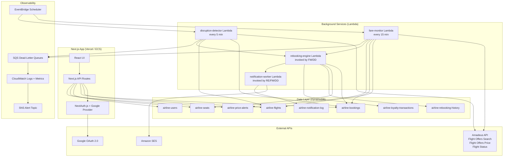

# Design Document: Real-Time Flight Rebooking

## Overview

This feature extends the existing airline booking application with real-time Amadeus pricing, fare drop detection, proactive rebooking, disruption handling, ancillary bundling, multilingual AI concierge, loyalty points, and full observability. The design builds on the existing Next.js 15 app router, DynamoDB tables, AWS Lambda functions, Terraform infrastructure, NextAuth.js, and AWS Bedrock.

The core philosophy is **event-driven background processing** for monitoring tasks (fare polling, disruption detection) and **transactional consistency** for booking mutations (rebooking, cancellation, refunds). All new background services run as independent Lambda functions scheduled via EventBridge, keeping them decoupled from the Next.js application.

---

## Architecture



### Key Architectural Decisions

**Decision 1: Background Lambdas, not Next.js cron routes.**
Fare monitoring and disruption detection run on strict schedules (15 min / 5 min). Next.js route handlers are request-scoped and cannot reliably run on a schedule. EventBridge + Lambda is the correct primitive here and aligns with the existing Lambda-heavy infrastructure.

**Decision 2: Amadeus client lives in a shared Lambda layer.**
The Amadeus OAuth token, retry logic, and environment switching are shared across fare-monitor and disruption-detector. A shared Lambda layer (`amadeus-client`) avoids duplication and ensures consistent token caching.

**Decision 3: DynamoDB transactions for all booking mutations.**
Rebooking (cancel original + create new + update seats) must be atomic. The existing `TransactWriteCommand` pattern in `lib/db.ts` is extended to cover rebooking operations.

**Decision 4: In-app notifications via DynamoDB polling, not WebSockets.**
The existing app has no WebSocket infrastructure. In-app notifications are written to `airline-notification-log` and polled by the frontend via a `/api/notifications` route with SWR. This avoids introducing a new transport layer.

**Decision 5: Rate limiting via in-memory sliding window in Next.js middleware.**
No Redis is provisioned. A `Map`-based sliding window in Next.js middleware (`middleware.ts`) handles per-user and per-IP rate limiting. Thresholds are read from environment variables.

---

## Components and Interfaces

### 1. Amadeus API Client (`lib/amadeus.ts`)

Singleton client with OAuth 2.0 token management, retry logic, and environment switching.

```typescript
interface AmadeusClient {
  searchFlightOffers(params: FlightSearchParams): Promise<AmadeusFlightOffer[]>
  priceFlightOffer(offer: AmadeusFlightOffer): Promise<PricedOffer>
  getFlightStatus(flightNumber: string, date: string): Promise<FlightStatus>
  getToken(): Promise<string>  // proactive refresh when expiry < 60s
}

interface FlightSearchParams {
  originLocationCode: string
  destinationLocationCode: string
  departureDate: string
  adults: number
  currencyCode: 'USD'
  max: number
}
```

Environment switching: `AMADEUS_ENV=test|production` maps to `https://test.api.amadeus.com` or `https://api.amadeus.com`.

### 2. Fare Monitor Lambda (`lambdas/fare-monitor/index.js`)

Scheduled every 15 minutes by EventBridge. Polls all active price alerts and bookings.

```
handler():
  1. Fetch all active price alerts from airline-price-alerts
  2. Group alerts by routeKey to minimize Amadeus API calls
  3. For each unique route, call amadeusClient.searchFlightOffers()
  4. Cache result in airline-flights with TTL metadata
  5. For each alert: if currentPrice <= threshold → invoke notification-worker
  6. For each booking with autoRebook=true: if currentPrice <= bookedPrice * 0.9 → flag booking, invoke rebooking-engine
  7. Emit CloudWatch metrics: pollSuccess, pollFailure, alertsEvaluated, rebookingsTriggered
```

### 3. Disruption Detector Lambda (`lambdas/disruption-detector/index.js`)

Scheduled every 5 minutes by EventBridge. Monitors flights departing within 24 hours.

```
handler():
  1. Query airline-bookings for confirmed bookings with departure within 24h
  2. Deduplicate by flightId
  3. For each flight, call amadeusClient.getFlightStatus()
  4. If status indicates delay >= 60min, cancellation, or weather advisory:
     a. Find up to 3 alternatives on same route within 6h window
     b. Invoke notification-worker for each affected booking
     c. Write DisruptionEvent to airline-notification-log
  5. Emit CloudWatch metrics
```

### 4. Rebooking Engine Lambda (`lambdas/rebooking-engine/index.js`)

Invoked synchronously by fare-monitor and disruption-detector, and via API for manual triggers.

```
rebook(bookingId, replacementFlightId):
  1. Load original booking and replacement flight
  2. Verify replacement has available seats in same cabin class
  3. DynamoDB TransactWrite:
     - Cancel original booking (status = 'cancelled')
     - Release original seats (status = 'available')
     - Create new booking (status = 'confirmed')
     - Reserve new seats (status = 'reserved')
     - Decrement availableSeats on new flight
  4. Write rebooking history record
  5. Calculate fare saved, credit loyalty points (5 pts/USD saved)
  6. Invoke notification-worker with rebooking confirmation
```

### 5. Notification Worker Lambda (`lambdas/notification-worker/index.js`)

Invoked by all background services. Routes notifications to in-app and/or email channels.

```typescript
interface NotificationPayload {
  userId: string
  type: 'fare_drop' | 'rebooking_confirmed' | 'disruption' | 'refund' | 'alert_expiry'
  message: string
  metadata: Record<string, unknown>
}
```

Routing logic:
- Load user preferences from `airline-users`
- If `notificationPreferences` missing → treat as `{ inApp: true, email: false }`
- If `inApp: true` → write to `airline-notification-log`
- If `email: true` → call SES `SendEmail`
- If both false → log suppression, skip delivery

### 6. Next.js API Routes (new)

| Route | Method | Description |
|---|---|---|
| `/api/price-alerts` | GET, POST | List / create price alerts |
| `/api/price-alerts/[alertId]` | PUT, DELETE | Update / delete alert |
| `/api/bookings/[bookingId]/rebook` | POST | Manual rebook trigger |
| `/api/bookings/[bookingId]/auto-rebook` | PATCH | Toggle autoRebook flag |
| `/api/bookings/[bookingId]/ancillaries` | GET, POST | List / add ancillaries |
| `/api/notifications` | GET | Poll in-app notifications |
| `/api/notifications/[id]/read` | PATCH | Mark notification read |
| `/api/user/loyalty` | GET | Loyalty balance + history |
| `/api/user/preferences` | GET, PATCH | Notification preferences |
| `/api/flights/[flightId]/price` | GET | Real-time price confirmation |

### 7. Google SSO (`auth.ts` extension)

Add NextAuth Google provider alongside existing Credentials provider. The `signIn` callback handles upsert logic:

```typescript
// In NextAuth config
providers: [
  Google({
    clientId: process.env.GOOGLE_CLIENT_ID,
    clientSecret: process.env.GOOGLE_CLIENT_SECRET,
  }),
  Credentials({ ... }) // existing
]

callbacks: {
  async signIn({ user, account, profile }) {
    if (account?.provider === 'google') {
      // upsert user: create if new email, link googleId if existing
    }
    return true
  },
  async jwt({ token, user, account }) {
    if (account?.provider === 'google') token.pictureUrl = user.image
    // ...existing id mapping
  }
}
```

### 8. Rate Limiting Middleware (`middleware.ts`)

Sliding window counter stored in a module-level `Map`. Reads thresholds from env vars with 60 rpm default.

```typescript
// Key: userId (authenticated) or IP (unauthenticated)
// Window: 60 seconds
// Default limit: 60 requests/minute
// Response on exceed: 429 with Retry-After header
```

### 9. Ancillary Bundler (`lib/ancillary.ts`)

```typescript
interface AncillaryOption {
  type: 'seat_upgrade' | 'baggage' | 'lounge' | 'hotel' | 'ground_transport'
  name: string
  price: number
  provider: string
  metadata: Record<string, unknown>
}

interface Bundle {
  id: string
  components: AncillaryOption[]
  individualTotal: number
  bundlePrice: number  // always <= individualTotal
}
```

### 10. Fare Parser (`lib/fare-parser.ts`)

```typescript
interface Fare {
  route: string          // e.g. "ORD#JFK"
  departureDate: string  // YYYY-MM-DD
  cabinClass: 'ECONOMY' | 'PREMIUM_ECONOMY' | 'BUSINESS' | 'FIRST'
  priceUsd: number       // positive, max 2 decimal places
  currency: string       // ISO 4217
  dataTimestamp: string  // ISO 8601
  offerId: string        // Amadeus offer ID for price confirmation
}

function parseFare(raw: unknown): Result<Fare, ParseError>
function serializeFare(fare: Fare): string  // JSON
function deserializeFare(json: string): Result<Fare, ParseError>
```

---

## Data Models

### Extended `User` type (`lib/types.ts`)

```typescript
export type User = {
  id: string
  name: string
  email: string
  passwordHash: string | null  // null for SSO-only accounts
  createdAt: string
  // New fields (all optional for backward compat)
  googleId?: string
  pictureUrl?: string
  loyaltyPoints?: number          // default: 0
  notificationPreferences?: {
    inApp: boolean                // default: true
    email: boolean                // default: false
  }
}
```

### Extended `Booking` type (`lib/types.ts`)

```typescript
export type Booking = {
  // ...existing fields
  autoRebook?: boolean            // default: false
  ancillaries?: AncillaryItem[]
  refund?: {
    amount: number
    timestamp: string
    reference: string
  }
}

export type AncillaryItem = {
  type: string
  name: string
  price: number
  addedAt: string
}
```

### `PriceAlert` (`lib/types.ts`)

```typescript
export type PriceAlert = {
  userId: string          // PK
  alertId: string         // SK
  routeKey: string        // "ORD#JFK" — GSI PK
  departureDate?: string
  threshold: number       // USD
  createdAt: string
  lastCheckedAt?: string
  status: 'active' | 'triggered' | 'expired'
}
```

### `RebookingHistory` (`lib/types.ts`)

```typescript
export type RebookingHistory = {
  userId: string          // PK
  timestamp: string       // SK
  originalBookingId: string
  newBookingId: string
  fareSaved: number
  trigger: 'auto' | 'manual' | 'disruption'
}
```

### `LoyaltyTransaction` (`lib/types.ts`)

```typescript
export type LoyaltyTransaction = {
  userId: string          // PK
  transactionId: string   // SK
  type: 'booking' | 'ancillary' | 'rebooking_saving' | 'cancellation'
  points: number          // positive = credit, negative = debit
  referenceId: string     // bookingId or rebookingHistoryId
  timestamp: string
}
```

### `NotificationLog` (`lib/types.ts`)

```typescript
export type NotificationLog = {
  userId: string          // PK
  notificationId: string  // SK
  channel: 'inApp' | 'email'
  message: string
  sentAt: string
  status: 'sent' | 'suppressed' | 'failed'
  read?: boolean          // for inApp channel
}
```

### DynamoDB Table Schemas

| Table | PK | SK | GSIs |
|---|---|---|---|
| `airline-price-alerts` | `userId` (S) | `alertId` (S) | `routeKey-index` on `routeKey` |
| `airline-rebooking-history` | `userId` (S) | `timestamp` (S) | — |
| `airline-loyalty-transactions` | `userId` (S) | `transactionId` (S) | — |
| `airline-notification-log` | `userId` (S) | `notificationId` (S) | — |

Existing tables receive no schema changes. New fields on `airline-users` and `airline-bookings` are added as sparse attributes (DynamoDB schemaless).

---

## Correctness Properties

*A property is a characteristic or behavior that should hold true across all valid executions of a system — essentially, a formal statement about what the system should do. Properties serve as the bridge between human-readable specifications and machine-verifiable correctness guarantees.*

### Property 1: Fare cache freshness

*For any* route-date combination, if a cached fare entry exists and its `dataTimestamp` is within 5 minutes of the current time, the system should return the cached entry without calling the Amadeus API.

**Validates: Requirements 1.1, 1.4**

### Property 2: Price confirmation before booking

*For any* flight offer, the system should call the Amadeus Flight Offers Price endpoint and return the confirmed price before a booking is created, such that the booking price equals the confirmed price and not the search price.

**Validates: Requirements 1.2**

### Property 3: Price alert round-trip

*For any* user and valid route with a fare drop threshold, creating a price alert and then querying that user's alerts should return an alert record containing the same route and threshold.

**Validates: Requirements 2.1, 2.7**

### Property 4: Fare drop notification trigger

*For any* active price alert where the current fare is at or below the alert's threshold, the notification worker should be invoked exactly once with that user's ID and the fare drop details.

**Validates: Requirements 2.3, 2.4**

### Property 5: Auto-rebook eligibility flagging

*For any* confirmed booking with `autoRebook=true` where the current fare on the same route is 10% or more below the booked price, the fare monitor should flag that booking as eligible for rebooking.

**Validates: Requirements 2.5, 3.1**

### Property 6: Rebooking atomicity

*For any* rebooking operation that completes successfully, the original booking should have `status='cancelled'` and the new booking should have `status='confirmed'` — both states must hold simultaneously after the transaction.

**Validates: Requirements 3.2, 4.4**

### Property 7: Rebooking notification content

*For any* completed rebooking (fare-drop or disruption), the notification sent to the user should contain the original flight ID, the new flight ID, and the fare difference.

**Validates: Requirements 3.4, 4.6**

### Property 8: Rebooking history persistence

*For any* completed rebooking, querying the rebooking history for that user should return a record containing `originalBookingId`, `newBookingId`, `fareSaved`, and `timestamp`.

**Validates: Requirements 3.5**

### Property 9: Auto-rebook guard

*For any* booking with `autoRebook=false`, the rebooking engine should not create a new booking even when a qualifying fare drop is detected.

**Validates: Requirements 3.6, 13.3**

### Property 10: Disruption alternatives constraint

*For any* disruption event on a flight, the list of alternative flights presented to each affected user should contain at most 3 options, all on the same origin-destination route, all departing within 6 hours of the original departure time.

**Validates: Requirements 4.3**

### Property 11: Disruption event audit log

*For any* disruption event processed by the disruption detector, a log record should be written to `airline-notification-log` containing the flight ID, event type, and timestamp.

**Validates: Requirements 4.7**

### Property 12: Bundle price invariant

*For any* bundle of ancillary items, the bundle price should be less than or equal to the sum of the individual item prices.

**Validates: Requirements 5.2**

### Property 13: Bundle purchase atomicity

*For any* bundle purchase that completes successfully, all components of the bundle should appear on the booking's `ancillaries` list and the total charge should equal the bundle price.

**Validates: Requirements 5.3**

### Property 14: Ancillary time gate

*For any* attempt to add an ancillary item to a booking, the operation should succeed if the flight departure is more than 24 hours away and fail with a descriptive error if departure is 24 hours or less away.

**Validates: Requirements 5.5**

### Property 15: Ancillary refund on cancellation

*For any* booking with ancillary items that is cancelled, the refund amount should equal the base fare refund plus the sum of all ancillary charges.

**Validates: Requirements 5.6, 12.3**

### Property 16: Concierge tool error response

*For any* tool invocation by the concierge that returns an error, the concierge's response to the user should be a non-empty string (not an empty reply or raw error object).

**Validates: Requirements 6.6**

### Property 17: Concierge context window

*For any* conversation session, the concierge should correctly reference information from messages up to 20 turns earlier in the history array.

**Validates: Requirements 6.7**

### Property 18: Loyalty points accrual — booking

*For any* confirmed booking with base fare F (in USD), the user's `loyaltyPoints` balance should increase by exactly `floor(F * 10)` points after the booking is created.

**Validates: Requirements 7.1**

### Property 19: Loyalty points accrual — ancillary

*For any* ancillary purchase with price P (in USD), the user's `loyaltyPoints` balance should increase by exactly `floor(P * 5)` points after the purchase.

**Validates: Requirements 7.2**

### Property 20: Loyalty points accrual — rebooking saving

*For any* rebooking that saves S USD in fare, the user's `loyaltyPoints` balance should increase by exactly `floor(S * 5)` points after the rebooking.

**Validates: Requirements 7.3**

### Property 21: Loyalty points deduction on cancellation

*For any* booking cancellation, the user's `loyaltyPoints` balance after cancellation should equal `max(0, balance_before - points_credited_for_booking)`.

**Validates: Requirements 7.4, 7.6**

### Property 22: Fare round-trip serialization

*For any* valid `Fare` object, parsing the JSON produced by `serializeFare` should produce a `Fare` object that is deeply equal to the original.

**Validates: Requirements 8.3, 8.4**

### Property 23: Fare price validation

*For any* parsed `Fare` object, `priceUsd` should be a positive number with at most 2 decimal places (i.e., `priceUsd > 0` and `Math.round(priceUsd * 100) === priceUsd * 100`).

**Validates: Requirements 8.5**

### Property 24: Google SSO new user creation

*For any* Google OAuth callback with a valid profile (name, email, googleId) where the email does not exist in `airline-users`, the auth system should create exactly one new user record containing all four fields: `name`, `email`, `googleId`, `pictureUrl`.

**Validates: Requirements 9.2, 9.3, 9.5**

### Property 25: Google SSO no duplicate users

*For any* Google OAuth callback where the email already exists in `airline-users`, the total count of user records with that email should remain 1 after the callback is processed.

**Validates: Requirements 9.4**

### Property 26: Credentials sign-in guard for SSO accounts

*For any* user record that has a `googleId` but a null `passwordHash`, attempting to sign in via the credentials provider should return null (authentication rejected).

**Validates: Requirements 9.8**

### Property 27: Amadeus token proactive refresh

*For any* Amadeus API call where the current token's expiry is within 60 seconds of the call time, the client should request a new token before making the API call.

**Validates: Requirements 10.2**

### Property 28: Amadeus retry with exponential backoff

*For any* Amadeus API call that receives an HTTP 429 response, the client should retry the call at most 3 times with exponentially increasing delays before returning an error.

**Validates: Requirements 10.3**

### Property 29: Amadeus environment switching

*For any* value of the `AMADEUS_ENV` environment variable (`test` or `production`), the Amadeus client's base URL should match the corresponding Amadeus endpoint without requiring code changes.

**Validates: Requirements 10.5**

### Property 30: Notification channel routing

*For any* notification dispatch where the user's `notificationPreferences.email` is `true`, the SES send function should be called exactly once; where `inApp` is `true`, a record should be written to `airline-notification-log`.

**Validates: Requirements 11.4, 11.5**

### Property 31: Notification preferences default

*For any* user record that does not contain a `notificationPreferences` field, the notification dispatcher should behave as if `{ inApp: true, email: false }` were set, without writing to the stored record.

**Validates: Requirements 11.7, 15.4**

### Property 32: Refund policy by cancellation timing

*For any* booking cancellation where departure is 24 or more hours away, the refund amount should equal the full base fare plus all ancillary charges; where departure is less than 24 hours away, the refund amount should equal the partial amount calculated by the late-cancellation policy.

**Validates: Requirements 12.1, 12.2**

### Property 33: Refund record persistence

*For any* processed refund, the booking record should contain `refund.amount`, `refund.timestamp`, and `refund.reference` after the transaction completes.

**Validates: Requirements 12.4**

### Property 34: Refund retry on failure

*For any* refund transaction that fails, the system should retry the operation up to 3 times; after 3 consecutive failures, the booking should be marked with a `manualReview` flag.

**Validates: Requirements 12.6**

### Property 35: Auto-rebook default

*For any* newly created booking, the `autoRebook` field should be `false`.

**Validates: Requirements 13.1**

### Property 36: Rate limit 429 with Retry-After

*For any* API route where a user or IP exceeds the configured request rate, the response should be HTTP 429 with a `Retry-After` header containing a positive integer number of seconds.

**Validates: Requirements 14.1, 14.2, 14.3**

### Property 37: Rate limit default threshold

*For any* API route where the rate limit environment variable is absent, the effective limit should be 60 requests per minute per user or IP.

**Validates: Requirements 14.4, 14.5**

### Property 38: User loyalty points default

*For any* user record that does not contain a `loyaltyPoints` field, the system should treat the value as `0` without writing to the stored record.

**Validates: Requirements 15.3**

### Property 39: Missing DynamoDB table error handling

*For any* read operation targeting a new feature table that does not yet exist, the system should return a structured error object identifying the missing table name rather than propagating an unhandled exception.

**Validates: Requirements 16.5**

### Property 40: Structured log fields

*For any* Lambda invocation or Next.js API route handler, the emitted log entry should be valid JSON containing at minimum the fields `correlationId` and `duration`.

**Validates: Requirements 18.1**

---

## Error Handling

### Amadeus API Errors

| Scenario | Behaviour |
|---|---|
| HTTP 429 | Exponential backoff, max 3 retries, then return cached data |
| HTTP 4xx (not 429) | Log status + Amadeus error code + correlationId, return structured error |
| HTTP 5xx | Same as 4xx, plus retry (same as 429 path) |
| Network unreachable | Treat as 5xx, apply retry + fallback |
| Quota exhausted | Log quota-exceeded, cease calls for billing period, fall back to cache |
| Token expired | Proactive refresh; if refresh fails, return auth error |

### DynamoDB Errors

| Scenario | Behaviour |
|---|---|
| `ResourceNotFoundException` | Return descriptive error identifying missing table |
| `TransactionCanceledException` | Return conflict error (e.g., seat already reserved) |
| `ConditionalCheckFailedException` | Return conflict error with context |
| Unhandled exception | Log with correlationId, return 500 |

### Rebooking Errors

| Scenario | Behaviour |
|---|---|
| No seats in same cabin | Do not rebook; notify user of fare drop only |
| Transaction conflict | Retry once; if still fails, notify user to retry manually |
| Replacement flight cancelled | Abort rebooking; notify user |

### Refund Errors

| Scenario | Behaviour |
|---|---|
| Refund transaction fails | Retry up to 3 times with 1s delay |
| 3 retries exhausted | Mark booking `manualReview: true`, log with bookingId + amount |

### Notification Errors

| Scenario | Behaviour |
|---|---|
| SES send failure | Log failure, write `status: 'failed'` to notification log |
| Both channels disabled | Log suppression against user record, skip delivery |

---

## Testing Strategy

### Dual Testing Approach

Both unit tests and property-based tests are required. Unit tests cover specific examples, integration points, and edge cases. Property-based tests verify universal correctness across randomized inputs.

**Property-based testing library**: `fast-check` (TypeScript-native, works in Jest/Vitest)

Install: `npm install --save-dev fast-check`

### Property-Based Test Configuration

- Minimum **100 iterations** per property test (`numRuns: 100` in fast-check)
- Each test tagged with a comment: `// Feature: realtime-flight-rebooking, Property N: <property_text>`
- Each correctness property above maps to exactly one property-based test

Example structure:

```typescript
import fc from 'fast-check'

// Feature: realtime-flight-rebooking, Property 22: Fare round-trip serialization
it('fare serialization round-trips correctly', () => {
  fc.assert(
    fc.property(arbitraryFare(), (fare) => {
      const json = serializeFare(fare)
      const result = deserializeFare(json)
      expect(result.ok).toBe(true)
      expect(result.value).toEqual(fare)
    }),
    { numRuns: 100 }
  )
})
```

### Unit Test Focus Areas

- Google SSO `signIn` callback: new user creation, existing user linking, missing claims rejection
- Amadeus client: token refresh timing, retry count, environment URL selection
- Fare parser: malformed input rejection, required field validation
- Rate limiter middleware: per-user vs per-IP keying, default threshold fallback
- Loyalty points calculation: booking, ancillary, rebooking saving, cancellation deduction
- Refund policy: 24h boundary, ancillary inclusion, retry-to-manual-review path
- Notification dispatcher: channel routing, both-disabled suppression, missing preferences default
- Rebooking engine: atomicity (mock DynamoDB transactions), cabin class guard, autoRebook=false guard

### Integration Test Focus Areas

- Full booking → fare drop → auto-rebook flow (mocked Amadeus, real DynamoDB local)
- Google SSO callback → user upsert → JWT issuance
- Bundle purchase → loyalty credit → cancellation → loyalty deduction
- Disruption event → alternatives selection → user notification

### Property Test Arbitraries

Key generators needed for fast-check:

```typescript
// Arbitrary valid Fare
const arbitraryFare = () => fc.record({
  route: fc.tuple(fc.stringMatching(/^[A-Z]{3}$/), fc.stringMatching(/^[A-Z]{3}$/))
           .map(([a, b]) => `${a}#${b}`),
  departureDate: fc.date().map(d => d.toISOString().slice(0, 10)),
  cabinClass: fc.constantFrom('ECONOMY', 'PREMIUM_ECONOMY', 'BUSINESS', 'FIRST'),
  priceUsd: fc.float({ min: 0.01, max: 10000, noNaN: true })
              .map(p => Math.round(p * 100) / 100),
  currency: fc.constant('USD'),
  dataTimestamp: fc.date().map(d => d.toISOString()),
  offerId: fc.uuid(),
})

// Arbitrary User with optional new fields
const arbitraryUser = () => fc.record({
  id: fc.uuid(),
  name: fc.string({ minLength: 1 }),
  email: fc.emailAddress(),
  passwordHash: fc.option(fc.string(), { nil: null }),
  createdAt: fc.date().map(d => d.toISOString()),
  loyaltyPoints: fc.option(fc.nat(), { nil: undefined }),
  notificationPreferences: fc.option(
    fc.record({ inApp: fc.boolean(), email: fc.boolean() }),
    { nil: undefined }
  ),
})
```
